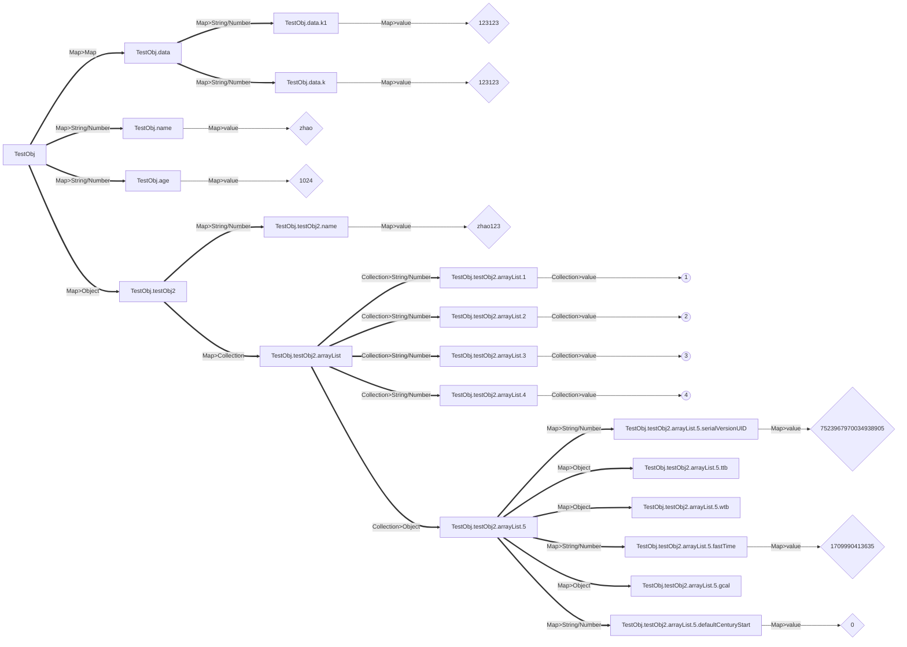
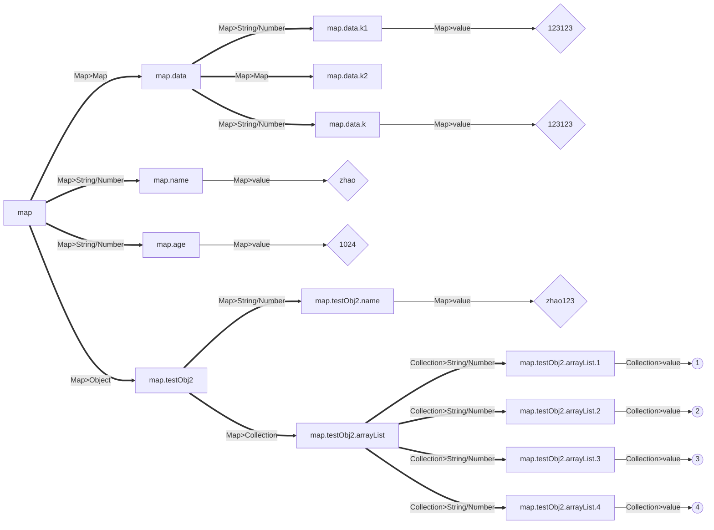
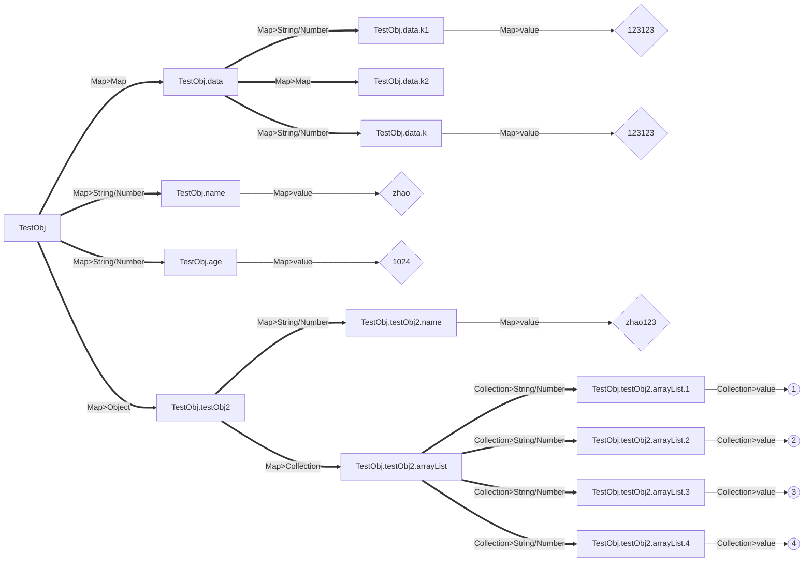

#  varFormatter

对象/变量格式化工具库，其支持将一个对象进行按照 JSON XML HTML 等格式进行转换，并获取到结果字符串！

## 介绍

通过此库，您可以实现将一个任意类型的对象进行按照 JSON XML HTML
等格式进行转换，并获取到结果字符串，是非常方便的数据对象格式化工具库，其具有强大的性能和类反射的缓存机制，能够不进行过多的解析和转换！

### 获取方式

您可以直接通过 maven 获取到此库的依赖，下面是一个依赖的实例。

```xml

<dependencies>
    <!-- 引入库的依赖 -->
    <dependency>
        <groupId>io.github.BeardedManZhao</groupId>
        <artifactId>varFormatter</artifactId>
        <version>1.0.1</version>
    </dependency>
    <!-- 引入库所需要的工具类 -->
    <dependency>
        <groupId>io.github.BeardedManZhao</groupId>
        <artifactId>zhao-utils</artifactId>
        <!-- TODO 1.0.3 版本之后，建议使用 1.0.20240315 版本，否则有时候会出现一些函数找不到的错误！ -->
        <version>1.0.20240315</version>
    </dependency>
</dependencies>
```

## 使用示例

本小节将演示 varFormatter 的使用案例！您根据案例可以快速了解其使用方法！

### 格式化组件的基本使用

在下面我们将使用各种 varFormatter 进行一些对象的格式化操作！

#### 获取到格式化组件

在这里我们提供了一个实例，在实例中，通过 VarFormatter 获取到了 json 格式化组件，并演示了 `getFormatter(boolean)` 函数中的形参的作用！

```java
import top.lingyuzhao.varFormatter.core.Formatter;
import top.lingyuzhao.varFormatter.core.VarFormatter;

public class Test {

    public static void main(String[] args) {
        // 使用单例模式 获取到 json 格式化组件
        final Formatter formatter0 = VarFormatter.JSON.getFormatter(true);
        // 使用单例模式 再次获取到 json 的格式化组件
        final Formatter formatter1 = VarFormatter.JSON.getFormatter(true);
        // 使用多例模式 获取到 json 格式化组件
        final Formatter formatter2 = VarFormatter.JSON.getFormatter(false);
        // 判断三个组件的内存地址是否相同
        // 结论 单例获取到的都是同一个内存地址的组件
        System.out.println(formatter0 == formatter1);
        System.out.println(formatter0 == formatter2);
        System.out.println(formatter1 == formatter2);
    }
}
```

#### 格式化一个任意类型的对象

在此库中，我们提供了一个 `format(Object)` 函数，可以将任意类型的对象进行格式化！其基于反射+缓存机制，相同对象的结构只会被解析一次！

```java
import top.lingyuzhao.varFormatter.core.Formatter;
import top.lingyuzhao.varFormatter.core.VarFormatter;

import java.util.ArrayList;
import java.util.HashMap;

/**
 * 测试类
 *
 * @author zhao
 */
public class Test {

    public static void main(String[] args) {
        // 使用单例模式 获取到 json 格式化组件
        final Formatter formatter0 = VarFormatter.JSON.getFormatter(true);
        // 实例化两个 TestObj 对象
        TestObj testObj1 = new TestObj();
        TestObj testObj2 = new TestObj();
        // 修改第二个对象中的 age 为 2048
        testObj2.age = 2048;
        // 将两个对象进行格式化操作 获取到对象的 json 结构
        System.out.println(formatter0.format(testObj1));
        System.out.println(formatter0.format(testObj2));
    }

    // 准备了一个复杂的类
    static class TestObj {
        String name = "zhao";
        int age = 1024;
        HashMap<String, Object> data = new HashMap<>();
        TestObj2 testObj2 = new TestObj2();

        {
            data.put("k", 123123);
            data.put("k1", "123123");
        }

        public static class TestObj2 {
            String name = "zhao123";
            ArrayList<Integer> arrayList = new ArrayList<>();

            {
                arrayList.add(1);
                arrayList.add(2);
                arrayList.add(3);
                arrayList.add(4);
            }
        }
    }
}
```

下面就是格式化的两个 json 的结果

```json lines
{
  "data": {
    "k1": "123123",
    "k": 123123
  },
  "name": "zhao",
  "age": 1024,
  "testObj2": {
    "name": "zhao123",
    "arrayList": [
      1,
      2,
      3,
      4
    ]
  }
}
{
  "data": {
    "k1": "123123",
    "k": 123123
  },
  "name": "zhao",
  "age": 2048,
  "testObj2": {
    "name": "zhao123",
    "arrayList": [
      1,
      2,
      3,
      4
    ]
  }
}
```

#### 格式化一个Map对象

当我们的对象是一个 Map 对象时，我们可以通过 `format(Map)` 函数进行格式化，此方法具有更快的速度，能够实现更加稳定和快速的功能。

```java
import top.lingyuzhao.varFormatter.core.Formatter;
import top.lingyuzhao.varFormatter.core.VarFormatter;

import java.util.HashMap;

/**
 * 测试类
 *
 * @author zhao
 */
public class Test {

    public static void main(String[] args) {
        // 创建一个 Map 对象
        final HashMap<String, Object> hashMap = new HashMap<>();
        hashMap.put("age", 21);
        hashMap.put("name", "ly");
        // 再创建一个 Map 对象
        final HashMap<String, Object> hashMap1 = new HashMap<>();
        hashMap1.put("age", 22);
        hashMap1.put("name", "ty");
        // Map 中再嵌套一个子Map
        hashMap.put("friend", hashMap1);
        // 使用单例模式 获取到 json 格式化组件
        final Formatter formatter0 = VarFormatter.JSON.getFormatter(true);
        // 直接根据 Map 对象进行格式化
        System.out.println(formatter0.format(hashMap));
    }
}

```

下面就是格式化的结果

```json
{
  "name": "ly",
  "friend": {
    "name": "ty",
    "age": 22
  },
  "age": 21
}
```

#### 格式化一个 DataObj 对象

此对象是一个内置的数据节点类，可以直接被解析成为一种 Map 的方式来进行格式化，不需要进行任意的结构解析和反射操作，因此性能较号。

```java
import top.lingyuzhao.varFormatter.core.Formatter;
import top.lingyuzhao.varFormatter.core.VarFormatter;

import java.util.ArrayList;
import java.util.HashMap;
import java.util.List;

/**
 * 测试类
 *
 * @author zhao
 */
public class Test {

    public static void main(String[] args) {
        // 获取到 json 格式化组件
        final Formatter formatter = VarFormatter.JSON.getFormatter(true);
        // 将 对象转为 json 格式
        System.out.println(formatter.format(new TestObj()));

        // 获取到 xml 格式化组件
        final Formatter formatter1 = VarFormatter.XML.getFormatter(true);
        // 将 对象转为 xml 格式
        System.out.println(formatter1.format(new TestObj()));

        // 获取到 html 格式化组件
        final Formatter formatter2 = VarFormatter.HTML.getFormatter(true);
        // 将 对象转为 html 格式
        System.out.println(formatter2.format(new HtmlObj()));
    }

    static class HtmlObj {
        String h1 = "大标题";
        String h2 = "小标题";
        List<li> ul = new ArrayList<>();

        {
            ul.add(new li());
            ul.add(new li());
            ul.add(new li());
        }

        static class li {
            String li = "行数据";
        }
    }

    static class TestObj {
        String name = "zhao";
        int age = 1024;
        HashMap<String, Object> data = new HashMap<>();
        TestObj2 testObj2 = new TestObj2();

        {
            data.put("k", 123123);
            data.put("k1", "123123");
        }

        public static class TestObj2 {
            String name = "zhao123";
            ArrayList<Integer> arrayList = new ArrayList<>();

            {
                arrayList.add(1);
                arrayList.add(2);
                arrayList.add(3);
                arrayList.add(4);
            }
        }
    }
}

```

#### 格式化一个 XmlNodeObj 对象

`XmlNodeObj` 是 `DataObj` 的子类，其具有`DataObj` 的所有特点，但是其还具有属性的功能，它能够接收一些属性，格式化组件会按照这个属性自动构造数据。

```java
import top.lingyuzhao.varFormatter.core.Formatter;
import top.lingyuzhao.varFormatter.core.VarFormatter;
import top.lingyuzhao.varFormatter.utils.XmlNodeObj;

/**
 * 测试类
 *
 * @author zhao
 */
public class Test {

    public static void main(String[] args) {
        // 使用单例模式 获取到 HTML 格式化组件
        final Formatter formatter0 = VarFormatter.HTML.getFormatter(true);
        // 构建一个 body 和 html 标签
        final XmlNodeObj body = new XmlNodeObj("body");
        final XmlNodeObj xmlNodeObj = new XmlNodeObj("html", body);
        // 设置 html 标签的 lang 属性 
        xmlNodeObj.setAttr("lang", "zh");

        // 设置body标签内部的标签
        body.put("p", "这里是一些段落文本");
        // 在body标签内部添加一个div标签
        final XmlNodeObj div = new XmlNodeObj("div");
        // 设置 div 标签的属性 这里是设置的字体颜色
        div.setAttr("style", "color:#0f0");
        // 设置 div 标签内部的文本
        div.put("div", "这里是一些 div 中的段落文本");
        // 把 div 标签提供给 body
        body.put(div);

        // 直接打印出 HTML 格式的文本
        System.out.println(formatter0.format(xmlNodeObj));
    }
}
```

下面是格式化之后的结果

```html

<html lang="zh">
<body><p>这里是一些段落文本</p>
<div style="color:#0f0">
    <div>这里是一些 div 中的段落文本</div>
</div>
</body>
</html>
```

### 各类格式化组件的使用

处理 json 类型的格式化组件，还有其它的型号，xml 格式化组件，html 格式化组件以及其它组件，都具有相同的使用方法，下面就是使用方法的演示实例。

#### xml 格式化组件演示实例

处理 xml 类型的格式化组件，它能够将任意的对象使用标签的方式转换成为一个 xml 格式的文本，xml
类型是具有根节点的，如果您格式化的是一个Map类型的对象，是支持指定根节点名字的，要指定根节点可以在 `format` 函数中指定
name 参数！

```java
import top.lingyuzhao.varFormatter.core.Formatter;
import top.lingyuzhao.varFormatter.core.VarFormatter;

import java.util.ArrayList;
import java.util.HashMap;

/**
 * 测试类
 *
 * @author zhao
 */
public class Test {

    public static void main(String[] args) {
        // 使用单例模式 获取到 XML 格式化组件
        final Formatter formatter0 = VarFormatter.XML.getFormatter(true);
        // 将对象进行格式化操作 获取到对象的 xml 结构
        System.out.println(formatter0.format(new TestObj()));
    }

    // 准备了一个复杂的类
    static class TestObj {
        String name = "zhao";
        int age = 1024;
        HashMap<String, Object> data = new HashMap<>();
        TestObj2 testObj2 = new TestObj2();

        {
            data.put("k", 123123);
            data.put("k1", "123123");
        }

        public static class TestObj2 {
            String name = "zhao123";
            ArrayList<Integer> arrayList = new ArrayList<>();

            {
                arrayList.add(1);
                arrayList.add(2);
                arrayList.add(3);
                arrayList.add(4);
            }
        }
    }
}
```

下面是处理之后的 xml 字符串

```xml

<TestObj>
    <data>
        <k1>123123</k1>
        <k>123123</k>
    </data>
    <name>zhao</name>
    <age>1024</age>
    <testObj2>
        <name>zhao123</name>
        <arrayList>
            <arrayList>1</arrayList>
            <arrayList>2</arrayList>
            <arrayList>3</arrayList>
            <arrayList>4</arrayList>
        </arrayList>
    </testObj2>
</TestObj>
```

#### html 格式化组件演示实例

此组件是 HTML 格式化组件，是 xml 格式化组件的子类，它可以在实现 xml/html 格式转换的前提下，还保证其中字段的顺序，这对于html来说是很重要的，如果html
中的标签顺序不一致，则页面会错乱！

```java
import top.lingyuzhao.varFormatter.core.Formatter;
import top.lingyuzhao.varFormatter.core.VarFormatter;

import java.util.ArrayList;
import java.util.HashMap;

/**
 * 测试类
 *
 * @author zhao
 */
public class Test {

    public static void main(String[] args) {
        // 使用单例模式 获取到 HTML 格式化组件
        final Formatter formatter0 = VarFormatter.HTML.getFormatter(true);
        // 将对象进行格式化操作 获取到对象的 HTML 结构
        System.out.println(formatter0.format(new TestObj()));
    }

    // 准备了一个复杂的类
    static class TestObj {
        String name = "zhao";
        int age = 1024;
        HashMap<String, Object> data = new HashMap<>();
        TestObj2 testObj2 = new TestObj2();

        {
            data.put("k", 123123);
            data.put("k1", "123123");
        }

        public static class TestObj2 {
            String name = "zhao123";
            ArrayList<Integer> arrayList = new ArrayList<>();

            {
                arrayList.add(1);
                arrayList.add(2);
                arrayList.add(3);
                arrayList.add(4);
            }
        }
    }
}
```

下面是处理之后的字符串

```xml

<TestObj>
    <name>zhao</name>
    <age>1024</age>
    <data>
        <k1>123123</k1>
        <k>123123</k>
    </data>
    <testObj2>
        <name>zhao123</name>
        <arrayList>
            <arrayList>1</arrayList>
            <arrayList>2</arrayList>
            <arrayList>3</arrayList>
            <arrayList>4</arrayList>
        </arrayList>
    </testObj2>
</TestObj>
```

#### Mermaid 格式化组件演示实例

Mermaid 是一种图结构的格式化组件，它能够将任意的类结构转换为 Mermaid 格式的文本，Mermaid 格式是具有图结构的，您可以将一个对象直接按照
Mermaid
类结构进行转换，这经常能够适用于观察类结构的场景，接下来就是有关的代码示例！

```java
import top.lingyuzhao.varFormatter.core.Formatter;
import top.lingyuzhao.varFormatter.core.VarFormatter;

import java.util.ArrayList;
import java.util.Date;
import java.util.HashMap;

/**
 * 测试类
 *
 * @author zhao
 */
public class Test {

    public static void main(String[] args) {
        // 使用单例模式 获取到 MERMAID 格式化组件
        final Formatter formatter0 = VarFormatter.MERMAID.getFormatter(true);
        // 将对象进行格式化操作 获取到对象的 MERMAID 结构图的代码 并打印出来
        System.out.println("graph LR");
        System.out.println(formatter0.format(new TestObj()));
    }

    // 准备了一个复杂的类
    static class TestObj {
        String name = "zhao";
        int age = 1024;
        HashMap<String, Object> data = new HashMap<>();
        TestObj2 testObj2 = new TestObj2();

        {
            data.put("k", 123123);
            data.put("k1", "123123");
        }

        public static class TestObj2 {
            String name = "zhao123";
            ArrayList<Object> arrayList = new ArrayList<>();

            {
                arrayList.add(1);
                arrayList.add(2);
                arrayList.add(3);
                arrayList.add(4);
                // 这里使用了一个 Date 类 增大 类的复杂度
                arrayList.add(new Date());
            }
        }
    }
}
```

下面是运行结果，可以直接做为 Mermaid 图展示！



### 数据输出方法的示例

库中针对一个实例进行格式转换之后会将结果返回给用户，而返回的结果可以是字符串或者数据流，下面就是关于数据流输出的示例！

#### 字符串输出

您可以调用 `Formatter.format` 方法进行字符串输出！这样的操作从库的首个版本发布之后就被支持了，您可以很方便地使用它，在上面的诸多示例中使用的也是字符串输出，下面是一个示例！

```java
import top.lingyuzhao.varFormatter.core.Formatter;
import top.lingyuzhao.varFormatter.core.VarFormatter;

import java.util.ArrayList;
import java.util.HashMap;

/**
 * 测试类
 *
 * @author zhao
 */
public class Test {

    public static void main(String[] args) {
        // 使用单例模式 获取到 MERMAID 格式化组件
        final Formatter formatter0 = VarFormatter.MERMAID.getFormatter(true);
        // 将对象进行格式化操作 获取到对象的 MERMAID 结构图的代码
        System.out.println("graph LR");
        System.out.println(formatter0.format(new TestObj()));
    }

    // 准备了一个复杂的类
    static class TestObj {
        String name = "zhao";
        int age = 1024;
        HashMap<String, Object> data = new HashMap<>();
        TestObj2 testObj2 = new TestObj2();

        {
            data.put("k", 123123);
            data.put("k1", "123123");
            data.put("k2", new HashMap<>());
        }

        public static class TestObj2 {
            String name = "zhao123";
            ArrayList<Object> arrayList = new ArrayList<>();

            {
                arrayList.add(1);
                arrayList.add(2);
                arrayList.add(3);
                arrayList.add(4);
            }
        }
    }
}
```

下面就是运行结果



#### 数据流输出

在 1.0.2 版本中，我们添加了数据流输出方法，您可以调用 `Formatter.formatToStream` 方法进行数据流输出！下面是一个示例！

```java
import top.lingyuzhao.varFormatter.core.Formatter;
import top.lingyuzhao.varFormatter.core.VarFormatter;

import java.io.IOException;
import java.io.PrintWriter;
import java.io.StringWriter;
import java.util.ArrayList;
import java.util.Date;
import java.util.HashMap;

/**
 * 测试类
 *
 * @author zhao
 */
public class Test {

    public static void main(String[] args) throws IOException {
        // 获取到一个字符串数据输出流
        try (
                final StringWriter stringWriter = new StringWriter();
                final PrintWriter bufferedWriter = new PrintWriter(stringWriter)
        ) {
            // 使用单例模式 获取到 MERMAID 格式化组件
            final Formatter formatter0 = VarFormatter.MERMAID.getFormatter(true);
            // 将对象进行格式化操作 获取到对象的 MERMAID 结构图的代码 并写到 bufferedWriter 中
            // 只需要调用 formatToStream 函数即可
            formatter0.formatToStream(new TestObj(), bufferedWriter);
            // 查看 stringWriter 中是否有数据
            // 由于是往 bufferedWriter 里面写的数据 bufferedWriter 中的数据流是 stringWriter
            // 因此相当于是往 stringWriter 中写入了数据
            System.out.println("graph LR");
            System.out.println(stringWriter);
        }
    }

    // 准备了一个复杂的类
    static class TestObj {
        String name = "zhao";
        int age = 1024;
        HashMap<String, Object> data = new HashMap<>();
        TestObj2 testObj2 = new TestObj2();

        {
            data.put("k", 123123);
            data.put("k1", "123123");
            data.put("k2", new HashMap<>());
        }

        public static class TestObj2 {
            String name = "zhao123";
            ArrayList<Object> arrayList = new ArrayList<>();

            {
                arrayList.add(1);
                arrayList.add(2);
                arrayList.add(3);
                arrayList.add(4);
            }
        }
    }
}
```

下面就是运行结果！



#### JavaToPython 类代码转换输出

在 1.0.2 版本中，我们添加了 `VarFormatter.J_TO_PYTHON` 格式化组件，其可以将一个 Java 对象转换为 Python 类代码！下面是一个示例！

```java
import top.lingyuzhao.varFormatter.core.Formatter;
import top.lingyuzhao.varFormatter.core.VarFormatter;

import java.util.ArrayList;
import java.util.HashMap;

/**
 * 测试类
 *
 * @author zhao
 */
public class Test {

    public static void main(String[] args) {
        // 使用单例模式 获取到 json 格式化组件
        final Formatter formatter0 = VarFormatter.J_TO_PYTHON.getFormatter(true);
        // 实例化 TestObj 对象
        TestObj testObj1 = new TestObj();
        // 转换成 python 类的代码 并打印出来
        System.out.println(formatter0.format(testObj1));
    }

    // 准备了一个复杂的类
    static class TestObj {
        String name = "zhao\nling\nyu\tzhao";
        int age = 1024;
        HashMap<String, Object> data = new HashMap<>();
        TestObj2 testObj2 = new TestObj2();

        {
            data.put("k", 123123);
            data.put("k1", "123\n\n123");
        }

        public static class TestObj2 {
            String name = "zhao123";
            ArrayList<Integer> arrayList = new ArrayList<>();

            {
                arrayList.add(1);
                arrayList.add(2);
                arrayList.add(3);
                arrayList.add(4);
            }
        }
    }
}
```

下面是格式转换之后的结果

```python
class Map:
    # 构造函数 / Constructor
    def __init__(self):
        self.data = {"k1":"123\n\n123","k":123123}
        self.name = 'zhao\nling\nyu\tzhao'
        self.age = 1024
        self.testObj2 = {"name":"zhao123","arrayList":[1,2,3,4]}

    def get_data(self):
        return self.data

    def set_data(self, v):
        self.data = v

    def get_name(self):
        return self.name

    def set_name(self, v):
        self.name = v

    def get_age(self):
        return self.age

    def set_age(self, v):
        self.age = v

    def get_test_obj2(self):
        return self.testObj2

    def set_test_obj2(self, v):
        self.testObj2 = v
```

## 更新记录

### 2024-03-15

_发布 1.0.2 版本！_

- 增加了 yaml 格式化组件！
- 增加了数据流的格式转换结果输出方法！
- 针对字符串的数据格式化操作进行转义解析，防止换行符导致错位
- 增加了 java 类 到 python 类代码的格式化转换工作！

### 2024-03-09

_发布 1.0.1 版本！_

- 针对具有 `null` 值的类的转换工作也可以顺利完成了！
- 增加了 Mermaid 格式化组件！您可以在 《Mermaid 格式化组件演示实例》 小节中查看到相关的调用！

### 2024-03-01

_初次发布 1.0.0 版本！_

- 支持 json xml html 格式化！
- 提供了 DataObj 和 XmlNodeObj 类，能够用于进行转换。
- 提供了针对类结构的解析模块，能够将任意的类结构转换为 json xml html 格式！
